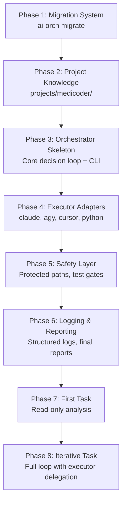

# AI Orchestrator (`ai-orch`) — Implementation Plan

## Goal

Build a **local-first, CLI-driven, multi-agent orchestrator** that uses Claude Code CLI as a lead reasoning agent, with `agy` (Antigravity CLI) and Cursor as implementation executors. The system operates on local repositories, manages persistent project knowledge, and runs autonomous engineering tasks with minimal human intervention.

## Resolved Design Decisions

| Decision | Resolution |
|---|---|
| **Communication** | Subprocess invocation of CLI tools (`claude -p`, `agy`, `cursor agent -p`) |
| **Billing** | Uses existing subscriptions only — no API top-up needed |
| **Claude role** | Lead reasoning agent via Claude Code CLI (MAX subscription). 2-5 calls per task. |
| **Executor routing** | Claude decides which executor per step. Both agy and Cursor are first-class. |
| **Fallback chain** | agy ↔ Cursor bidirectional. If both fail, fall back to Claude with cheap model. |
| **Repo interaction** | Local-first. All executors operate directly on local filesystem. |
| **User interaction** | Autonomous with progress streaming. Pauses only for safety gates. |
| **Migration** | Full migration first. Built as `ai-orch migrate` command. |
| **Install location** | `/Users/ali/root/ai-orch/` |
| **Medicoder repo** | `/Users/ali/root/Work/Medicoder/medicoder/medicoder` |
| **Python tooling** | Python 3.11+ with pip/venv |
| **Version control** | Own Git repo (separate from Medicoder) |
| **CLI name** | `ai-orch` |
| **Build approach** | Custom build (not CAO, Orca, or LangGraph) |

---

## Medicoder AI Configuration Inventory

> [!IMPORTANT]
> The Medicoder repo has a mature AI configuration that must be preserved and migrated.

### Discovered Configuration

#### Claude Code (`.claude/`)

| Item | Type | Classification |
|---|---|---|
| [settings.json](file:///Users/ali/root/ai-orch/medicoder/.claude/settings.json) | Permissions + hooks | **Project** — Medicoder-specific allow/deny lists |
| [settings.local.json](file:///Users/ali/root/ai-orch/medicoder/.claude/settings.local.json) | Local overrides | **Executor** — personal dev environment tweaks |
| **Agents** (4 files) | | |
| [db-reader.md](file:///Users/ali/root/ai-orch/medicoder/.claude/agents/db-reader.md) | Read-only DB inspector | **Project** — Medicoder taxonomy databases |
| [pcs-editor.md](file:///Users/ali/root/ai-orch/medicoder/.claude/agents/pcs-editor.md) | Precise edit executor | **Project + Reusable pattern** — "apply edits, run tests, report" |
| [am-achi-notes-author.md](file:///Users/ali/root/ai-orch/medicoder/.claude/agents/am-achi-notes-author.md) | Notes authoring agent | **Project** — ICD-10-AM/ACHI taxonomy notes |
| [pcs-notes-author.md](file:///Users/ali/root/ai-orch/medicoder/.claude/agents/pcs-notes-author.md) | Notes authoring agent | **Project** — ICD-10-PCS taxonomy notes |
| **Skills** (2) | | |
| [catchup/SKILL.md](file:///Users/ali/root/ai-orch/medicoder/.claude/skills/catchup/SKILL.md) | Branch status summary | **Global** — reusable across projects |
| [pr/SKILL.md](file:///Users/ali/root/ai-orch/medicoder/.claude/skills/pr/SKILL.md) | PR creation workflow | **Global** — reusable across projects |
| **Hooks** (5 scripts) | | |
| [block-paid-runs.sh](file:///Users/ali/root/ai-orch/medicoder/.claude/hooks/block-paid-runs.sh) | Cost safety gate | **Project** — blocks expensive Gemini API pipeline runs |
| [protect-databases.sh](file:///Users/ali/root/ai-orch/medicoder/.claude/hooks/protect-databases.sh) | File protection | **Project** — prevents edits to taxonomy snapshots |
| [block-ai-attribution.sh](file:///Users/ali/root/ai-orch/medicoder/.claude/hooks/block-ai-attribution.sh) | Git safety | **Project** — no AI attribution in commits |
| [validate-readonly-query.sh](file:///Users/ali/root/ai-orch/medicoder/.claude/hooks/validate-readonly-query.sh) | DB safety | **Project** — enforces read-only SQLite access |
| [verify-before-stop.sh](file:///Users/ali/root/ai-orch/medicoder/.claude/hooks/verify-before-stop.sh) | Quality gate | **Global pattern** — run tests before declaring done |
| **Workflows** (2) | | |
| [fix-until-green.js](file:///Users/ali/root/ai-orch/medicoder/.claude/workflows/fix-until-green.js) | Iterative test fixer | **Global** — reusable "fix tests in rounds" pattern |
| [audit-eval-contamination.js](file:///Users/ali/root/ai-orch/medicoder/.claude/workflows/audit-eval-contamination.js) | Data quality audit | **Project** — audits case files for eval contamination |

#### Cursor (`.cursor/`)

| Item | Type | Classification |
|---|---|---|
| [hooks.json](file:///Users/ali/root/ai-orch/medicoder/.cursor/hooks.json) | Hook configuration | **Executor** — adapts Claude hooks for Cursor format |
| [claude-adapter.sh](file:///Users/ali/root/ai-orch/medicoder/.cursor/hooks/claude-adapter.sh) | Hook adapter | **Executor** — bridges Claude hooks → Cursor hooks |
| [block-bulk-git-add.sh](file:///Users/ali/root/ai-orch/medicoder/.cursor/hooks/block-bulk-git-add.sh) | Git safety | **Project** — prevents `git add -A` |
| [readonly-sqlite.sh](file:///Users/ali/root/ai-orch/medicoder/.cursor/hooks/readonly-sqlite.sh) | DB safety | **Executor** — Cursor-specific SQLite guard |
| [am-full-runs.mdc](file:///Users/ali/root/ai-orch/medicoder/.cursor/rules/am-full-runs.mdc) | Cost safety rule | **Project** — blocks expensive tuning runs without approval |

#### Antigravity / Gemini (`.agents/`, `.gemini/`)

| Item | Type | Classification |
|---|---|---|
| [hooks.json](file:///Users/ali/root/ai-orch/medicoder/.agents/hooks.json) | Hook configuration | **Executor** — AGY-specific hook format |
| `.gemini/antigravity-ide/` | IDE state | **Ephemeral** — can be ignored |

#### MCP & Other

| Item | Type | Classification |
|---|---|---|
| [.mcp.json](file:///Users/ali/root/ai-orch/medicoder/.mcp.json) | MCP server config | **Tool** — GitHub Copilot MCP (currently disabled in local settings) |
| [.env](file:///Users/ali/root/ai-orch/medicoder/.env) | Environment secrets | **Security** — GEMINI_API_KEY, must not be migrated |

### Key Observations

1. **Sophisticated safety layer**: The repo has 5+ safety hooks protecting databases, preventing expensive API calls, blocking AI attribution, and enforcing test-before-stop. These MUST be preserved.
2. **Cross-executor hook sharing**: Cursor hooks call Claude hooks via a `claude-adapter.sh` bridge. AGY hooks duplicate Claude hooks in AGY format. This is the main pain point the orchestrator should solve.
3. **Specialized agents**: 4 Claude Code agents with precise scoping (read-only DB access, edit-only, notes authoring). These represent Medicoder domain expertise.
4. **Reusable patterns**: `catchup`, `pr`, `fix-until-green`, and `verify-before-stop` are generic — good candidates for global skills.
5. **Cost controls**: Multiple hooks prevent agents from running expensive Gemini API pipeline calls without user approval.

---

## Proposed Changes

### Phase 1: Migration System

Build `ai-orch migrate` as the first deliverable. This command scans a project directory, inventories AI config, classifies it, and produces a structured migration manifest.

#### [NEW] `orchestrator/migrate.py`

Scans a project directory for:
- `.claude/` (settings, agents, skills, hooks, workflows, worktrees)
- `.cursor/` (rules, hooks)
- `.agents/` (hooks)
- `.gemini/`
- `.mcp.json`
- `CLAUDE.md`, `AGENTS.md`, `GEMINI.md`, `SKILL.md`
- `*.mdc` files

Produces:
- `migration/<project>/inventory.md` — human-readable inventory
- `migration/<project>/manifest.yaml` — structured classification
- `migration/<project>/original/` — snapshot of all discovered files
- `projects/<project>/` — translated project knowledge base

---

### Phase 2: Project Knowledge Layer

#### [NEW] `projects/medicoder/project.yaml`

```yaml
name: medicoder
path: /Users/ali/root/Work/Medicoder/medicoder/medicoder
description: ICD-10 medical coding system using Gemini for taxonomy ranking

executors:
  lead: claude
  primary: agy       # Swappable: change to "cursor" when quota refreshes
  secondary: cursor

safety:
  protected_paths:
    - database/
  blocked_commands:
    - git push
    - git merge
  require_tests_before_stop: true
  require_approval_for:
    - full pipeline runs (--config configs/full.yml)
    - tune_level.py --force-full

testing:
  command: env/bin/python -m unittest discover -s tests -t .
  interpreter: env/bin/python

git:
  automatic_commit: false
  automatic_push: false
  block_bulk_add: true
  block_ai_attribution: true
```

#### [NEW] `projects/medicoder/context.md`

High-level project description, architecture, conventions — derived from README.md and existing AI config.

#### [NEW] `projects/medicoder/safety.md`

Consolidated safety policies extracted from all hooks across all three agent configs.

---

### Phase 3: Orchestrator Skeleton

#### [NEW] `orchestrator/__init__.py`
#### [NEW] `orchestrator/main.py`

Entry point. Implements the core decision loop:

```
1. Load project config
2. Load relevant knowledge
3. Invoke Claude CLI (-p mode) with context + objective
4. Parse Claude's structured JSON decision
5. Route to selected executor (agy CLI or cursor agent CLI)
6. Capture executor result
7. Feed result back to Claude for review
8. Iterate or complete
9. Produce final report
```

#### [NEW] `orchestrator/cli.py`

Click-based CLI:
```bash
ai-orch start <project> --goal "..."     # Start a task
ai-orch migrate <path>                    # Migrate existing AI config
ai-orch project add <name> <path>         # Register a project
ai-orch project list                      # List projects
ai-orch task list <project>               # List tasks
ai-orch task status <project> <task-id>   # Check task status
```

#### [NEW] `orchestrator/context.py`

Builds the context payload for Claude's reasoning calls. Assembles:
- Project knowledge (context.md, safety.md, architecture)
- Task objective and constraints
- Current iteration state
- Latest executor result
- Relevant skills

#### [NEW] `orchestrator/state.py`

Manages persistent task state via JSON files:
```
tasks/<project>/<task-id>/
├── task.yaml          # Objective, constraints, config
├── state.json         # Current status, iteration count
├── iterations/        # Per-iteration records
├── results/           # Executor results
├── logs/              # Execution logs
└── report.md          # Final report
```

---

### Phase 4: Executor Adapters

#### [NEW] `executors/base.py`

```python
class Executor(ABC):
    @abstractmethod
    def execute(self, instruction: str, context: dict) -> ExecutorResult: ...
    
    @abstractmethod
    def is_available(self) -> bool: ...
```

#### [NEW] `executors/claude_executor.py`

Wraps `claude -p --output-format json` for lead reasoning:
```python
result = subprocess.run(
    ['claude', '-p', prompt, '--output-format', 'json', '--allowedTools', 'Read,Bash'],
    capture_output=True, text=True, cwd=project_path, timeout=300
)
```

#### [NEW] `executors/agy_executor.py`

Wraps `agy` CLI for implementation tasks.

#### [NEW] `executors/cursor_executor.py`

Wraps `cursor agent -p` for implementation tasks.

#### [NEW] `executors/python_executor.py`

Runs deterministic Python scripts (tests, benchmarks, file operations).

#### [NEW] `executors/router.py`

Routes tasks to executors. Claude decides which executor to use via structured JSON:
```json
{
  "action": "DELEGATE",
  "executor": "agy",
  "instruction": "...",
  "success_criteria": ["..."],
  "verification": ["tests"]
}
```

Fallback chain: if selected executor fails/unavailable, try the other. If both fail, escalate to Claude with cheap model.

---

### Phase 5: Safety Layer

#### [NEW] `orchestrator/safety.py`

Enforces project-level safety policies before executor actions:
- Checks protected paths
- Validates commands against blocklists
- Enforces test-before-stop
- Requires human approval for flagged operations

---

### Phase 6: Logging & Reporting

#### [NEW] `orchestrator/logging.py`

Structured logging with separate streams:
- Orchestrator decisions
- Claude reasoning
- Executor actions
- Test results
- Errors

#### [NEW] `orchestrator/report.py`

Generates final task report:
```markdown
# Task Report: <objective>

## Summary
...

## Iterations
1. Claude decided: ...
2. agy implemented: ...
3. Tests: passed/failed
4. Claude reviewed: ...

## Files Changed
...

## Metrics
...

## GitHub
NO ACTION TAKEN.
```

---

## Target Filesystem

```
/Users/ali/root/ai-orch/
├── README.md
├── pyproject.toml
├── .gitignore
├── .env                          # API keys if needed later
│
├── orchestrator/
│   ├── __init__.py
│   ├── main.py                   # Core decision loop
│   ├── cli.py                    # Click CLI
│   ├── context.py                # Context builder
│   ├── state.py                  # Task state management
│   ├── safety.py                 # Safety gates
│   ├── logging.py                # Structured logging
│   └── report.py                 # Report generation
│
├── executors/
│   ├── __init__.py
│   ├── base.py                   # Executor ABC
│   ├── claude_executor.py        # claude -p wrapper
│   ├── agy_executor.py           # agy CLI wrapper
│   ├── cursor_executor.py        # cursor agent -p wrapper
│   ├── python_executor.py        # Local Python/shell
│   └── router.py                 # Executor routing
│
├── migrate/
│   ├── __init__.py
│   ├── scanner.py                # Project AI config scanner
│   ├── classifier.py             # Item classification
│   └── translator.py             # Semantic translation
│
├── projects/
│   └── medicoder/
│       ├── project.yaml
│       ├── context.md
│       ├── safety.md
│       ├── conventions.md
│       └── skills/               # Medicoder-specific skills
│
├── skills/                       # Global reusable skills
│   ├── catchup/
│   ├── pr/
│   ├── fix-until-green/
│   └── verify-before-stop/
│
├── tasks/                        # Temporary task state
│   └── medicoder/
│
├── migration/                    # Migration snapshots
│   └── medicoder/
│       ├── original/
│       ├── inventory.md
│       └── manifest.yaml
│
├── logs/
└── config/
    └── global.yaml               # Global orchestrator config
```

---

## Verification Plan

### Automated Tests

```bash
# Unit tests for orchestrator components
python -m pytest tests/

# Integration test: migration scan
ai-orch migrate /Users/ali/root/Work/Medicoder/medicoder/medicoder

# Integration test: read-only task
ai-orch start medicoder --goal "Analyze the repository structure" --read-only

# Integration test: simple task
ai-orch start medicoder --goal "Run the test suite and summarize results"
```

### Manual Verification

1. Run `ai-orch migrate` against Medicoder → verify inventory matches what we found above
2. Run a read-only analysis task → verify Claude reasons correctly, no files modified
3. Run a simple implementation task → verify executor routing works, tests pass
4. Verify fallback: disable agy → confirm Cursor is used instead
5. Verify safety: attempt to modify `database/` → confirm blocked

---

## Implementation Order



> [!IMPORTANT]
> **Phase 1 (Migration) is the first deliverable** as requested. The orchestrator is built on top of the migrated knowledge base.

---

## Open Questions

> [!NOTE]
> These don't block implementation but will affect later phases.

1. **Worktree support**: The Medicoder `.claude/worktrees/` directory suggests existing worktree-based workflows. Should the orchestrator support git worktrees for V1, or defer to later?

2. **Workflow migration**: The Claude workflows (`fix-until-green.js`, `audit-eval-contamination.js`) are JS-based Claude Code features. Should the orchestrator replicate their logic in Python, or call Claude Code's workflow system?

3. **Agent migration**: The 4 specialized Claude agents (`db-reader`, `pcs-editor`, `am-achi-notes-author`, `pcs-notes-author`) are deeply Medicoder-specific. Should these become orchestrator skills, or remain as Claude Code agents that the orchestrator invokes?
